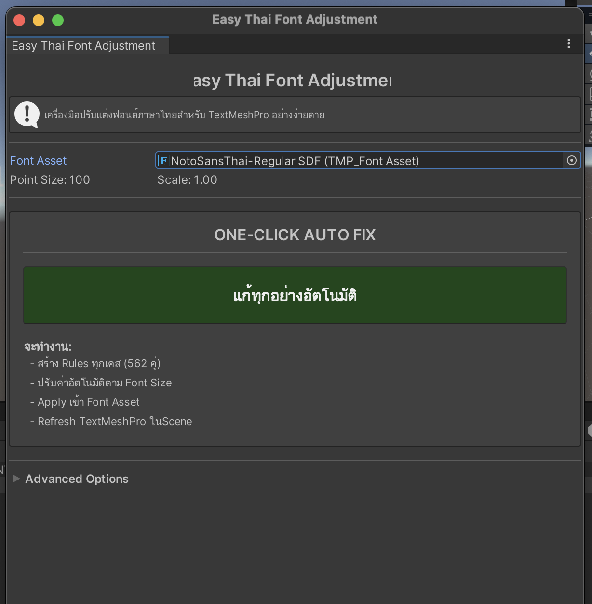
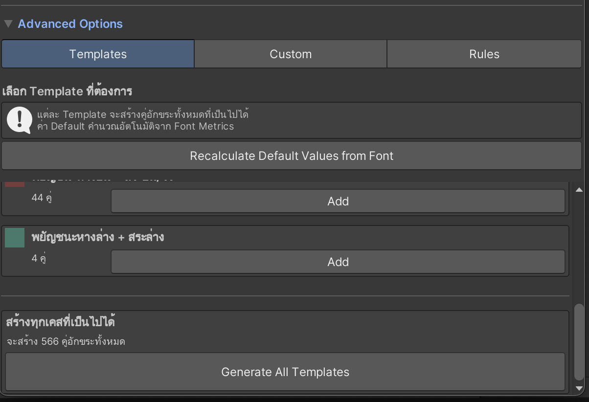

# Easy Thai Font Adjustment

Unity Editor tool for fixing Thai floating vowels and tone marks in TextMeshPro fonts with one click.

## Features

- **One-Click Auto Fix** - Automatically fixes all Thai character positioning issues
- **562 Character Pairs** - Covers all possible Thai character combinations
- **Smart Calculation** - Automatically calculates kerning values based on font size
- **Undo Support** - Built-in backup and undo functionality
- **Advanced Editing** - Fine-tune individual character pairs if needed

## Problem Solved

Thai fonts in TextMeshPro often display vowels and tone marks incorrectly:
- Upper vowels floating away from consonants (ิ ี ึ ื ั ็)
- Tone marks positioned too high (่ ้ ๊ ๋)
- Overlapping vowels and tone marks
- Collision with ascender consonants (ป ฝ ฟ ฬ)

**This tool fixes all of these automatically.**

## Installation

### Method 1: Unity Package Manager (Git URL)
1. Open Unity Package Manager (Window → Package Manager)
2. Click `+` → Add package from git URL
3. Enter: `https://github.com/poppod56/EasyThaiFontAdjustment.git`

### Method 2: Manual Installation
1. Download the repository
2. Copy `Assets/Editor/EasyThaiFontAdjustment.cs` to your project's `Assets/Editor/` folder
3. Unity will compile automatically

### Method 3: Unity Asset Store
Coming soon...

## Quick Start

1. Open **Tools → Easy Thai Font Adjustment**
2. Select your TextMeshPro Font Asset
3. Click **"แก้ทุกอย่างอัตโนมัติ"** (Fix Everything Automatically)
4. Done!

If you don't like the result, click **"Undo Last Changes"**

## Screenshots

*Simple one-click interface for quick fixes*

*Advanced options for fine-tuning*

## Requirements

- Unity 2021.3 or newer
- TextMeshPro 3.0 or newer
- Font must include Thai glyphs

## How It Works

The tool adds **Glyph Pair Adjustment Records** to your TextMeshPro Font Asset, which adjusts the positioning of character pairs using kerning. Values are automatically calculated based on:
- Font point size
- Ascender/descender height
- Scale factor

## Templates Included

| Template | Pairs | Description |
|----------|-------|-------------|
| Consonants + Upper Vowels | 264 | ก-ฮ + ิ ี ึ ื ั ็ |
| Consonants + Tone Marks | 176 | ก-ฮ + ่ ้ ๊ ๋ |
| Consonants + Thanthakhat | 44 | ก-ฮ + ์ |
| Upper Vowels + Tone Marks | 24 | Stacked marks |
| Upper Vowels + Thanthakhat | 6 | Vowel + ์ |
| Sara Am + Tone Marks | 4 | ำ + tone marks |
| Ascender Consonants | 44 | ป ฝ ฟ ฬ combinations |
| Descender Consonants | 4 | ฎ ฏ + ุ ู |

**Total: 562 pairs**

## Advanced Usage

### Using Templates
1. Open Advanced Options
2. Go to Templates tab
3. Select specific template
4. Adjust X/Y values if needed
5. Click "Add Rules"

### Custom Text Analysis
1. Go to Custom tab
2. Enter sample text with problems
3. Click "Analyze and Add Rules"
4. System detects problematic pairs automatically

### Fine-Tuning
1. Go to Rules tab
2. Edit individual pairs
3. Select/deselect pairs to apply
4. Click "Apply to Font Asset"

## Documentation

Full documentation (Thai): [EASY_THAI_FONT_ADJUSTMENT_GUIDE.md](./Assets/Editor/EASY_THAI_FONT_ADJUSTMENT_GUIDE.md)

## Troubleshooting

| Issue | Solution |
|-------|----------|
| No visible changes | Reimport Font Asset |
| Values seem wrong | Let system auto-calculate, or adjust offset in Templates |
| Too many rules | Clear All and add only needed ones |
| Missing glyphs | Ensure font contains all Thai characters |

## License

MIT License - Free to use in commercial and personal projects

## Contributing

Contributions welcome! Please:
1. Fork the repository
2. Create feature branch
3. Submit pull request

## Support

- Issues: [GitHub Issues](https://github.com/poppod56/EasyThaiFontAdjustment/issues)
- Discussions: [GitHub Discussions](https://github.com/poppod56/EasyThaiFontAdjustment/discussions)

## Changelog

### Version 1.0.0 (2025-11-07)
- Initial release
- One-click auto fix
- 7 templates covering 562 character pairs
- Undo support
- Advanced editing mode

## Credits

Created for Unity Thai developers who need proper Thai text rendering.

## Keywords

Unity, TextMeshPro, Thai Font, Thai Language, Kerning, Floating Vowels, Typography, Font Adjustment, Thai Characters
